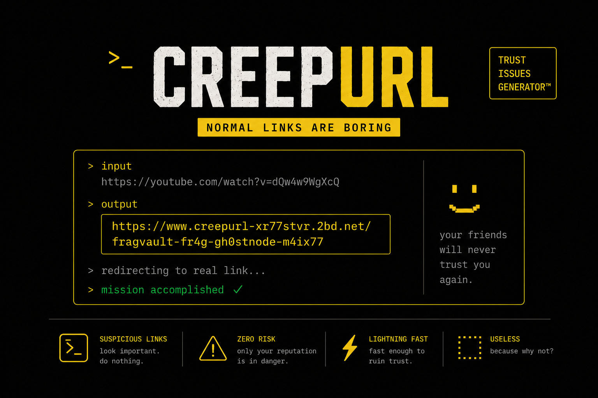
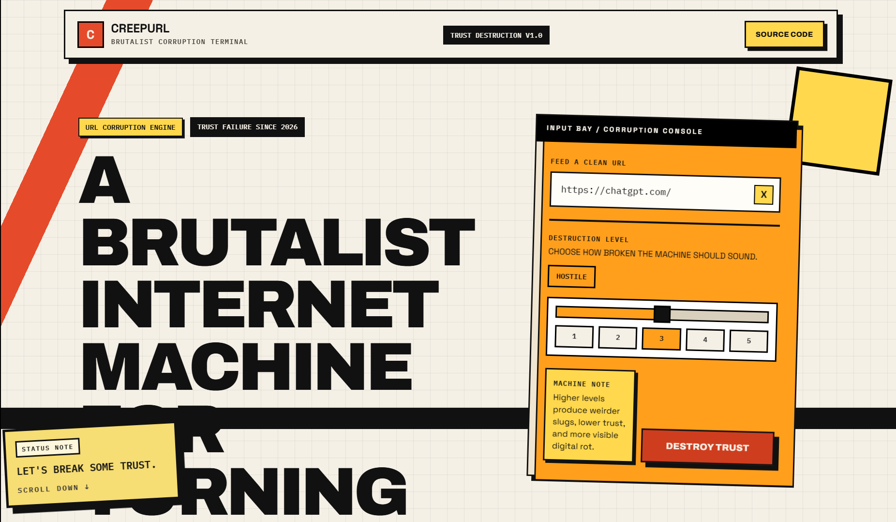
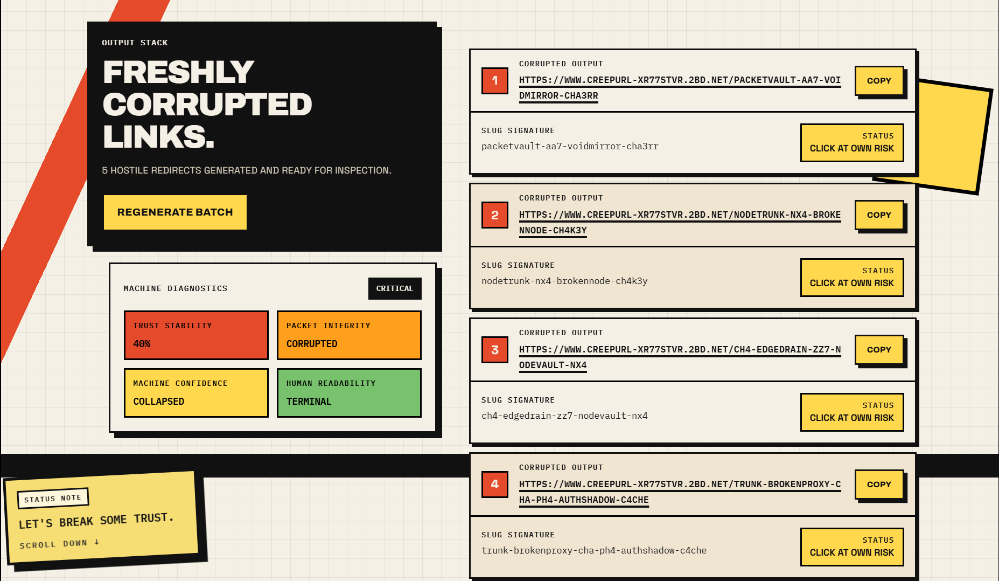

<div align="center">

# CreepURL

### certified useless internet technology™  



<br/>


<br/>

</div>
---

# What Is This?


CreepURL is a completely unnecessary website that generates chaotic fake URLs nobody asked for but somehow look important enough to click.

Because normal URL shorteners are boring.

So instead of:
```txt
youtube.com/watch?v=something
```

your friend receives:
```txt
https://www.creepurl-xr77stvr.2bd.net/cachefracture-edge-relay-gh0stnode
```

which immediately destroys trust in the friendship.

---

# Demo





---

# What does this thing actually do?

Technically?

It just redirects your friend to the actual link you wanted to send in the first place.

That's it.

You could literally send the real link directly.

But no.

We must first wrap it inside suspicious cyberpunk infrastructure so your friend thinks:
```txt
"why does bro send links like a darknet vendor"
```

---

# Features

- fake dangerous URLs
- industrial/neubrutalism UI
- unnecessary terminal energy
- trust destroying hyperlinks
- copy buttons that feel important
- internet corruption simulator
- routes forged in a raccoon-operated data center
- legally questionable aesthetics

---

# Main Purpose

Send this to your friends and watch them hesitate before clicking.

After 2–3 uses they may never trust your links again.

Mission accomplished.

---

# Example Outputs

```txt
https://www.creepurl-xr77stvr.2bd.net/echobuffer-ma1route-c4che-edgecorrupt
```

```txt
https://www.creepurl-xr77stvr.2bd.net/ma1-cachedead-k3y-noderoute-rel4y
```

```txt
https://www.creepurl-xr77stvr.2bd.net/fragvault-fr4g-gh0stnode-m4ix77
```

None of these mean anything.

Probably.

---

# Technology Stack

Frontend:
- React
- Vite
- bad ideas

Backend:
- Go
- one surviving API endpoint
- me trying my best with a new tech stack

Infrastructure:
- held together emotionally

---

# Why?

Modern websites:
```txt
minimal
clean
professional
productive
```

CreepURL:
```txt
yellow button go brrrr
```

---

# Safety Warning

Using CreepURL may cause:
- unnecessary confidence
- fake hacker energy
- suspicious group chat activity
- your friend replying:
  "bro what is this link"

We are not responsible for:
- broken trust
- paranoia
- corrupted timelines
- federal attention
- people refusing to click your messages anymore

---

# Important Disclaimer

This is a joke project.

Please do not:
- deploy national infrastructure with it
- send generated URLs to your bank
- use this during job interviews
- explain this project to serious investors

---

# Live Website

## 🌐 Go Try....
https://creepurl-1.onrender.com

(if it works)

---

# Final Notes

Built with duct tape, unstable infrastructure, and poor decision making.

If the website breaks:
```txt
good
```

That means it's authentic.
